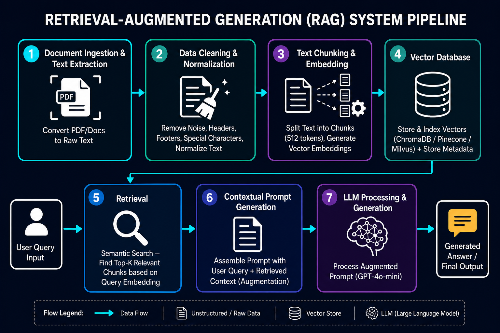
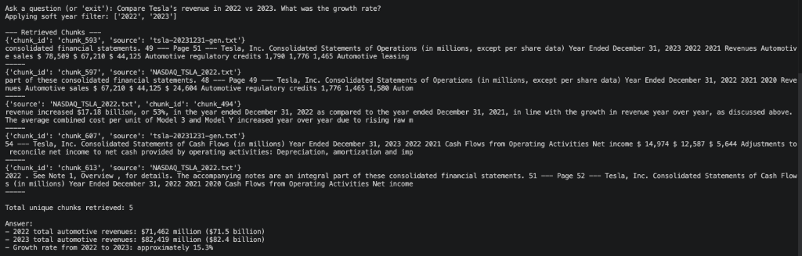

# Tesla Financial Document Q&A System using RAG

## Overview

This project implements an **end-to-end Retrieval-Augmented Generation (RAG) system** to answer questions from Tesla annual financial reports.

The system ingests raw PDF documents, processes and indexes them into a vector database, and enables **context-aware question answering** using LLMs grounded in retrieved data.

---

## Problem Statement

Financial documents such as 10-K reports are:

* large and unstructured
* difficult to query manually
* contain critical insights spread across sections

This project solves:

> "How can we accurately answer questions from financial documents using LLMs without hallucination?"

---

## Architecture



---

## Project Structure

```
tesla-rag-system/
│
├── data/
│   ├── raw/                # PDF files
│   ├── extracted/          # raw text
│   ├── cleaned/            # cleaned text
│   ├── chunked/            # chunked JSON
│   └── vector_db/          # ChromaDB storage
│
├── ingestion/
│   ├── document_loader/
│   ├── text_cleaning/
│   ├── chunking_strategy/
│   └── embedding_generator/
│
├── retrieval/
│   └── retriever.py        # vector DB + retrieval logic
│
├── generation/
│   └── generator.py        # prompt + LLM interaction
│
├── query_engine.py         # orchestrates pipeline
│
├── config/
│   └── parameters.yaml
│
└── README.md
```

---

## Key Features

### 1. End-to-End RAG Pipeline

* PDF → Text → Clean → Chunk → Embed → Store → Retrieve → Generate

---

### 2. Metadata-Aware Retrieval

* Uses `source` metadata for filtering
* Enables **year-specific queries (e.g., 2017 revenue)**

---

### 3. Query Understanding

* Extracts structured signals (e.g., year)
* Applies dynamic filtering during retrieval

---

### 4. Improved Retrieval Accuracy

* Combines:

  * semantic similarity
  * metadata filtering
  * query augmentation

---

### 5. Grounded Response Generation

* LLM answers strictly from retrieved context
* Prevents hallucination using prompt constraints

---

### 6. Financial Data Handling

* Handles tabular financial data from PDFs
* Converts raw numbers into human-readable format

---

## Technologies Used

* **Python**
* **LangChain**
* **ChromaDB**
* **OpenAI (Embeddings + LLM)**
* **PyPDFLoader**
* **YAML (config-driven pipeline)**

---

## Workflow

### 1. Data Ingestion

* Load PDFs using PyPDFLoader
* Extract text page-wise

### 2. Data Cleaning

* Remove noise, whitespace, formatting artifacts

### 3. Chunking

* RecursiveCharacterTextSplitter
* Chunk size: 400
* Overlap: 50

### 4. Embedding & Storage

* OpenAI `text-embedding-3-small` (1024 dimensions)
* Stored in ChromaDB with metadata

### 5. Retrieval

* Top-K similarity search
* Metadata filtering for precise results

### 6. Generation

* Prompt-based answer generation
* Numerical normalization (millions → billions)

---

## Example Query

**Input:**

```
What were Tesla’s total revenues in 2017?
```

**Retrieved Context:**

```
Total revenues $ 11,758,751 (in thousands)
```

**Output:**

```
Tesla’s total revenues in 2017 were approximately $11.76 billion.
```

---

## Key Challenges & Solutions

### 1. Empty Retrieval Results

* **Issue:** Vector DB loaded but no documents retrieved
* **Fix:** Ensured consistent `collection_name` in ChromaDB

---

### 2. Incorrect Retrieval (Wrong Year)

* **Issue:** Mixed-year results due to semantic similarity
* **Fix:** Added metadata filtering based on extracted year

---

### 3. Numeric Data Misinterpretation

* **Issue:** Raw values returned (in thousands)
* **Fix:** Prompt engineering to normalize units

---

### 4. Vector DB Inconsistency

* **Issue:** Multiple DB paths causing silent failures
* **Fix:** Standardized `persist_directory`

---

## Key Learnings

* RAG accuracy depends more on **retrieval quality than LLM capability**
* Metadata filtering is essential for **structured queries**
* Vector DB consistency (path, collection) is critical
* Financial data requires **special handling (tables, units)**

---

## Future Improvements

* Hybrid search (BM25 + vector)
* Evaluation framework (precision, recall)
* API deployment (FastAPI)
* UI interface for interactive querying
* Table-aware chunking for better financial extraction

---

## How to Run

### 1. Install Dependencies

```
pip install -r requirements.txt
```

---

### 2. Set Environment Variables

```
OPENAI_API_KEY=your_api_key
```

---

### 3. Run Pipeline

To run the end-to-end pipeline (which handles data ingestion, processing, vector DB creation, and starts the query engine):

```bash
python main.py
```

**Example Execution Output:**

```text
============================================================
Tesla Financial Intelligence System — RAG Pipeline
============================================================

[Step 0] Loading configuration...

[Step 1] Loading checkpoint...
  Checkpoint loaded: check_point.json

[Step 2] Archiving previously processed files...
  No previously processed files found — skipping archive.

[Step 3] Running ingestion pipeline...
  Extracting text from PDFs...
Successfully processed 7 PDF files.
  Cleaning extracted text...
Cleaned 7 files successfully.
  Chunking cleaned text...
Processed NASDAQ_TSLA_2022.txt → 2457 chunks
Processed NASDAQ_TSLA_2020.txt → 4522 chunks
Processed tsla-20231231-gen.txt → 1255 chunks
Total files processed: 7
  Generating embeddings and storing in ChromaDB...
Loaded 17901 documents successfully.
Chroma DB created and persisted successfully.
  Ingestion pipeline complete.

[Step 4] Updating checkpoint...
  Checkpoint updated: check_point.json

[Step 5] Starting query engine...
============================================================
Vector count: 17901
```



---

## Conclusion

This project demonstrates a **production-grade RAG pipeline** capable of:

* accurate document retrieval
* grounded LLM responses
* handling real-world financial data

It highlights the importance of **retrieval engineering, metadata design, and prompt control** in building reliable GenAI systems.

---
